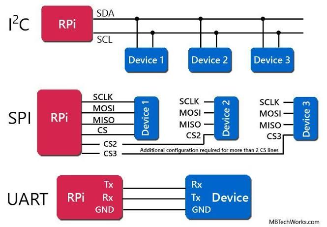

# RTL Interface Lab

Small protocol exercises built while learning RTL design and verification.

## Protocols

- UART: fixed 8-N-1 transmit and receive
- I2C: one-byte master write with ACK/NACK
- SPI: 8-bit master supporting modes 0 through 3



## Layout

Each protocol currently keeps hand-written RTL in `rtl/` and directed tests in `tb/`.

## Simulation

The examples use QuestaSim. Compile and run a representative test for each
protocol with:

```sh
cd uart
vlib work
vlog -sv rtl/*.sv tb/*.sv
vsim -c uart_loopback_tb -do "run -all; quit -f"

cd ../i2c
vlib work
vlog -sv rtl/*.sv tb/*.sv
vsim -c i2c_ack_tb -do "run -all; quit -f"

cd ../spi
vlib work
vlog -sv rtl/*.sv tb/*.sv
vsim -c spi_modes_tb -do "run -all; quit -f"
```
